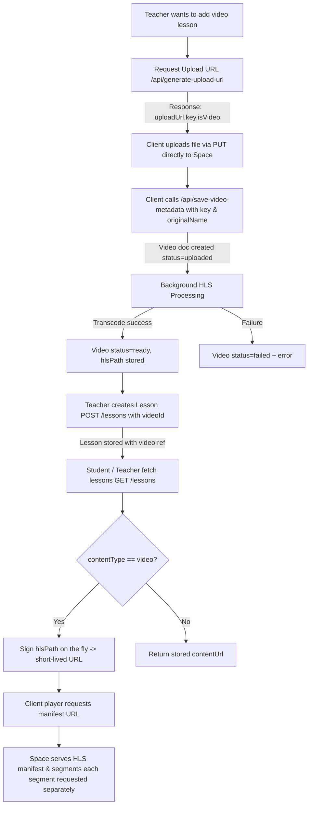

# Lesson Video Flow

This document explains the end‑to‑end flow for creating and consuming a video lesson. It covers upload URL generation, raw upload, metadata persistence, background processing (transcode to HLS), lesson creation, and signed delivery on fetch.

## High Level

## Detailed Steps

### 1. Generate Upload URL
Endpoint: `POST /api/generate-upload-url`

Input body:
- fileName
- fileType (e.g. video/mp4)
- courseName (optional)

Server returns a pre‑signed PUT URL (DigitalOcean Space / S3) plus object `key` and required headers. The client uploads the raw file directly (no server proxying large payloads).

### 2. Raw File Upload (Client Side)
The client performs a `PUT uploadUrl` with:
- Body: file bytes
- Headers: `Content-Type` (+ `x-amz-acl: public-read` only for non-video)

### 3. Save Video Metadata
Endpoint: `POST /api/save-video-metadata`

Body:
- key (returned earlier)
- originalName
- contentType

Creates a `Video` document with status = `uploaded`, then asynchronously starts background processing to transcode into HLS (single rendition in current implementation). Response gives `videoId` for later association with a lesson.

### 4. Background Processing (Transcode to HLS)
Process:
1. Download original object with key.
2. Run ffmpeg to produce `master.m3u8` + TS segments in a temp directory.
3. Upload processed HLS artifacts back to Space under a deterministic `hlsPath`.
4. Update `Video` document: `status=ready`, store `hlsPath` (e.g. `videos/hls/uuid/master.m3u8`). On error: `status=failed` + `error` message.

### 5. Create Lesson
Endpoint: `POST /lessons`

Body (video lesson):
- course (ObjectId)
- title
- contentType = `video`
- videoId (must reference a `Video` doc with `status=ready`)
- optional: order, quiz, gatedBy, durationSeconds

Body (non-video lesson):
- course, title, contentType != video
- contentUrl (persistent key or public URL) required

Logic:
- Video lessons store only `video` reference; `contentUrl` field is omitted (not required when `contentType==='video'`).
- Non-video lessons store a static `contentUrl` (never signed server-side).

### 6. Fetch Lessons
Endpoint: `GET /lessons?course=<id>`

Server response per lesson:
- Common fields: id, course, title, contentType, order, quiz, gatedBy, timestamps.
- For non-video: `contentUrl` is the stored persistent URL/key.
- For video: A fresh, short-lived signed URL for the `hlsPath` (master manifest) if `video.status==='ready'`. Also includes `videoStatus` so clients can show a "processing" indicator if null.

### 7. Client Playback
The client media player loads the signed manifest URL. Because segments are referenced relatively, each segment request will (depending on configuration) either need to be public inside the same private scope or individually signed (future enhancement: rewrite manifest to embed signed segment URLs). Current simplification signs only the manifest object.

## Data Model Adjustments
`Lesson` schema additions:
- `video: ObjectId (ref Video)` – only for video lessons.
- `contentUrl` now conditionally required only when `contentType !== 'video'`.

## Validation Rules
- Video lesson creation requires `videoId` and video must be `ready`.
- Non-video lesson creation requires `contentUrl`.
- Rejected if mandatory fields missing.

## Security Considerations
- Signed URLs expire quickly (default 300s) limiting leakage.
- Only authenticated + authorized (teacher/admin) users can generate upload URLs or save video metadata.
- Students only receive read access via temporary signed manifest URLs when fetching lessons.

## Future Enhancements
- Manifest rewriting to sign each segment individually.
- Multi-bitrate adaptive HLS ladder generation.
- Caching layer for signed URLs (short TTL) to reduce signing overhead.
- Progress webhooks / polling endpoint for video processing status.
- Soft-deletion and audit trail for lessons & videos.

## Error Cases
| Stage | Error | Handling |
|-------|-------|----------|
| Upload URL | Missing fileName/fileType | 400 response |
| Save metadata | Non-video contentType | 400 response |
| Processing | ffmpeg failure | Video status=failed + error saved |
| Create lesson | Video not ready | 409 conflict |
| Fetch lessons | Video not ready | Signed URL omitted; status indicates processing |

## Quick Sequence (Video Lesson)
1. Teacher: POST /api/generate-upload-url -> { uploadUrl,key }
2. Client: PUT uploadUrl (raw bytes)
3. Teacher: POST /api/save-video-metadata -> { videoId }
4. (Async) processing -> video.status=ready
5. Teacher: POST /lessons { videoId, contentType: 'video', ... }
6. Student: GET /lessons -> lesson.contentUrl = signed manifest URL (temporary)
7. Player streams via Space.

## Notes
- The backend does not persist signed URLs; they are generated per response.
- `durationSeconds` is optional and could be updated after processing if ffmpeg extracts metadata (not implemented yet).
